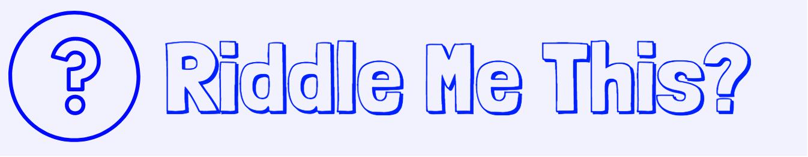

# Riddle Me This

## Hi there! Welcome to my Riddle Challenge! Try to take it on, if you dare!

Each player takes on a series of brain teasers designed to test players critical thinking logic skills. It is multiple choice, but it's up to you to figure out which choice is correct. But before you decide to just push every button until you guess right, you should know how the game is scored:

+ Getting a riddle right grants you 2 points.
+ If you guess wrong, you lose 1 point. In addition, you can't move on to the next riddle until you get the current one right.  

After one player plays through, Player 2 gets the chance to try and solve these riddles. Both players scores will be displayed at the end.

Try playing it [here](https://michaelm999.github.io/Projects/riddlemethis/questions.html)

## Development and Technologies

Riddle Me This is being built using HTML, CSS, Javascript, and the jQuery library.

## MVP
+ Order riddles appear in is randomized, and it tells you how many there are.
+ A page alert will tell the player if they have guessed right or wrong
+ If the player guesses wrong, it will give out a hint to help the player out.

## Bugs
+ The background of the Logo does not quite match up wiht the rest of the background. It is off hue slightly.

## Dream Features
+ Ability for both players to play again without refreshing.
+ Short answer section that require users to write in answers to questions.
+ Randomize the position of the answers.

## Credits
+ Game Logo made with [Logo Makr](https://logomakr.com/)
